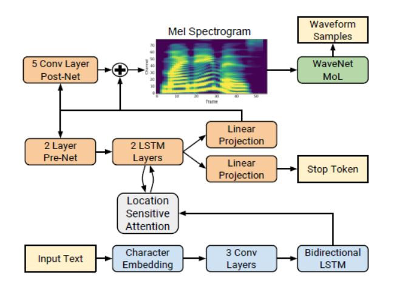

# CamFit

> 개발 기간 : 2021/03/01 ~ 2021/04/09


#### 🖐 Developer

* 박노정

* 백규태 

* 이경연 

* 이대헌 

* 이혜진 

  

### 🏋️‍♂️ CamFit 란?

> 웹 카메라(Cam) 과 피트니스(Fit)의 합성어

```text
홈 피트니스(Fit)를 하는 동안, 웹 카메라(Cam)를 통해 촬영하면 AI가 사용자의 자세를 음성으로 트레이닝해주는 서비스
```


* 기획 배경

  * Un-Tact 시대로 헬스장을 편하게 이용하지 못하게 되면서, 홈 피트니스를 택하는 사람이 늘고 있다. 특히 "헬린이(운동 초보자)"들은 정확한 자세를 하지 못해 다치거나 제대로 된 운동을 할 수 없다. 

    따라서, AI Training을 제공함으로써 헬린이들이 홈피트니스도 전문적으로 할 수 있도록 도와줄 것이다.

  * 최근 헬스장 이용 고객이 줄어들면서 트레이너들의 입지가 약해지고 있다. 이러한 상황에도 그들이 수업과 생계를 이어나갈 수 있도록 온라인 환경을 제공한다. 

    따라서, On-Tact 시대에 헬스 트레이너와 회원을 Online으로 연결시켜주는 플랫폼을 제공한다.


* 서비스 목적

  * AI Training 제공을 통해 운동자의 자세 교정
  * Training Class Flatform 제공을 통해 트레이너와 운동자 연결
* 주요 기능

  * AI 코칭 
    * 실시간으로 사용자의 자세를 분석해 음성으로 피드백 제공
  * 온라인 화상 클래스
    * 전문 트레이너와 운동자가 화상미팅으로 PT 진행 가능
  * [더 많은 기능 보기](#CamFit's-기능)


## 🔧 Install

* Django 실행

  1. 패키지 설치

  ```text
  $ pip install -r requirements.txt
  ```

  2. Django 실행

  ```text
  $ python manage.py runserver
  ```

* React 실행

  1. 패키지 설치

  ```text
  $ npm i
  ```

  2. React 실행

  ```text
  $ npm start
  ```


## 📑 Project Construction

* [Backend](./디렉토리구조/Backend.md)
* [Frontend](./디렉토리구조/Frontend.md)
* [AI](./디렉토리구조/AI.md)


++ 시퀀스 다이어 그램

[기능별 시퀀스 다이어그램](./기획/기능별 시퀀스다이어그램.md)


##  📂Tech Stack

### Tools

| Tool          | 기술                                                 |
| ------------- | ---------------------------------------------------- |
| GitLab        | 기능별 branch를 나눠서 코드 버전 관리                |
| Jira          | Issue 관리를 위해 Git과 연동하여 사용                |
| Scrum Poker   | Jira Issue 별 스프린트 시간 관리를 위한 어플리케이션 |
| VS Code       | code 구현을 위한 Tool                                |
| Google Chrome | 구현한 화면을 출력하기 위한 브라우저                 |

### ◾ Library

| Library | 내용                                      |
| ------- | ----------------------------------------- |
| Django  | Backend 구현을 위한 python web framework  |
| React   | Frontend 구현을 위한 JavaScript framework |

### ◾ Software Language

| Language   | 기술                             |
| ---------- | -------------------------------- |
| Python     | Backend 및 이미지 처리 구현 언어 |
| JavaScript | Frontend 구현 언어               |
| HTML/CSS   | Frontend 구현 언어               |


## 🌍 배포방법

#### Front

1. 패키지 설치

   ```
   npm i
   ```

2. 프로젝트 build

   ```
   npm run build
   ```

3. nginx 설치

   ```
   sudo apt install nginx
   ```

4. https를 위한 인증서 발급

   ```
   sudo apt-get install letsencrypt
   sudo letsencrypt certonly --standalone -d j4d104.p.ssafy.io
   ```

   

5. 프로젝트 build 결과물을 배포할 설정 파일 생성

   ```
   sudo touch /etc/nginx/sites-available/frontends.conf
   
   sudo vi frontends.conf
   
   server {
   	listen 80 default_server;
   	listen [::]:80 default_server;
   	server_name j4d104.p.ssafy.io;
   	
   	return 301 https://$server_name$request_uri;
   }
   
   server {
   	listen 443 ssl;
   	listen [::]:443 ssl;
   	
   	root /home/ubuntu/s04p23d104/frontends/build;
   	index index.html index.htm index.nginx-debian.html;
   	
   	server_name j4d104.p.ssafy.io;
   	
   	ssl_certificate /etc/letsencrypt/live/j4d104.p.ssafy.io/fullchain.pem;
   	ssl_certificate_key /etc/letsencrypt/live/j4d104.p.ssafy.io/privkey.pem;
   
   	location / {
   		try_files $uri $uri/ /index.html;
   	}
   }
   ```

6. nginx 신택스 검사 및 리부팅

   ```
   sudo nginx -t
   sudo service nginx restart
   ```


#### Backend

1. conda 가상환경에 requirements 설치

   ```
   pip install requirements.txt
   # 여기에서 uwsgi는 설치가 안됨
   ```

2. conda 가상환경에 uWSGI 설치

   ```
   conda install -c conda-forge uwsgi
   ```

3. nginx config 파일 수정

   ```
   sudo vi /etc/nginx/sites-enabled/frontends.config
   
   #코드 추가
   upstream backend {
   	server localhost:8000;
   }
   
   server {
   	
   	location / {
   		...
   	}
   	
   	location /api {
   		proxy_pass http://backend;
   		proxy_http_version 1.1;
   		proxy_set_header Connection "";
   
   		proxy_set_header Host $host;
   		proxy_set_header X-Real_IP $remote_addr;
   		proxy_set_header X-Forwarded-For $proxy_add_x_forwarded_for;
   		proxy_set_header X-Forwarded-Proto $scheme;
   		proxy_set_header X-Forwarded-Host $host;
   		proxy_set_header X-Forwarded-Port $server_port;
     }
   }
   ```

4. nginx 신택스 검사 및 재시작

   ```
   sudo nginx -t
   sudo service nginx restart
   ```

5. 백서버 실행

   ```
   uwsgi --http :8000 --module backends.wsgi
   ```


#### 결과

front : https://j4d104.p.ssafy.io

back : https://j4d104.p.ssafy.io/api


## 📖 기술 설명

* [ERD](./기획/ERD.png) 
* [Wire Frame](./기획/[인공눈물] 와이어프레임.pdf)
  * 상세보기 : https://www.notion.so/9813c4963a3f4b9795a326e00f4bf9e9


## CamFit's 기능

* AI 코칭
  * Teachable Machine
    * 티쳐블머신 웹 상에서 모델링 후 프론트엔드에서 적용하고 각각의 상태값을 조정하여 여러 상황에 대응하였다.
    * 시작, 갯수 세어주기, 자세 경고 등의 상황에서 각각에 맞는 wav파일을 재생하였다. 
  * TTS (음성합성)
    * 
    * 인코더
      * 문자열을 캐릭터 임베딩으로 변환한 벡터를 입력으로 받는다.
      * Convolution Layer와 Bidirectional LSTM Layer를 거쳐 feature를 인코딩한다.
    * 디코더
      * 인코더에서 얻은 encoded feature를 바탕으로 컨텍스트 벡터를 만들고 이에 attention mechanism을 적용한다.
      * 최종적으로 디코더에서 mel-spectrogram을 생성한다.
    * 보코더
      * 디코더를 통해 생성한 mel-spectrogram을 보코더에 입력하여 음성 waveform을 합성할 수 있다.
      * waveglow라는 보코더를 사용하였다.
    * TTS 구현 후 상황에 따른 wav파일을 프론트엔드에서 빠르게 쓸 수 있게 미리 만들어놓고 재생하였다.
* 온라인 화상 클래스
  * 화상 미팅
    * webRTC 패키지를 활용해 P2P통신을 구현하였다.
      * getUserMedia() : 로컬 비디오와 오디오에 접근하여 미디어 데이터를 가져온다.
      * RTCPeerConnection : 피어간 오디오, 비디오 통신을 활성화, 신호처리, 코덱관리, P2P 통신, 보안, 대역폭 관리 등을 수행
      * Google의 공용 stun Server를 이용해 타 IP에 접근할 수 있도록 하였다. `'stun:stun.l.google.com:19302'`
    * Firebase 를 활용해 실시간 데이터 통신을 구현하였다.

* 정보 게시판


