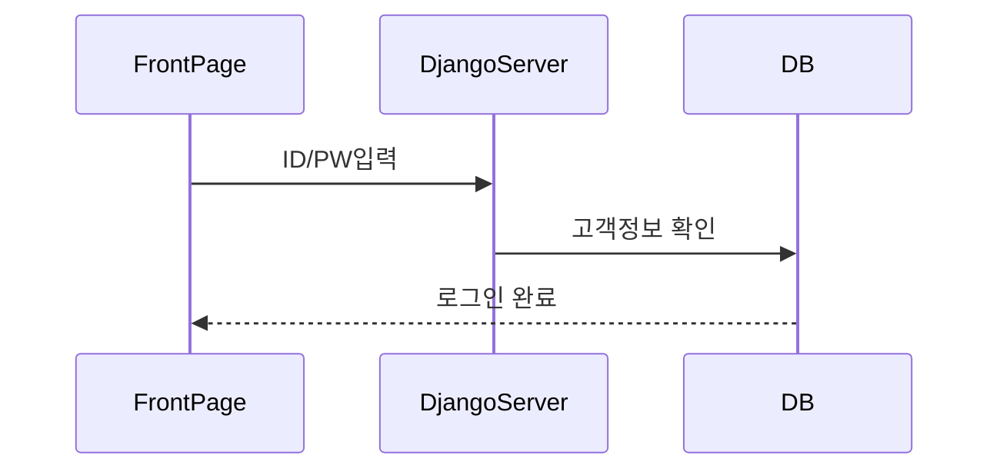
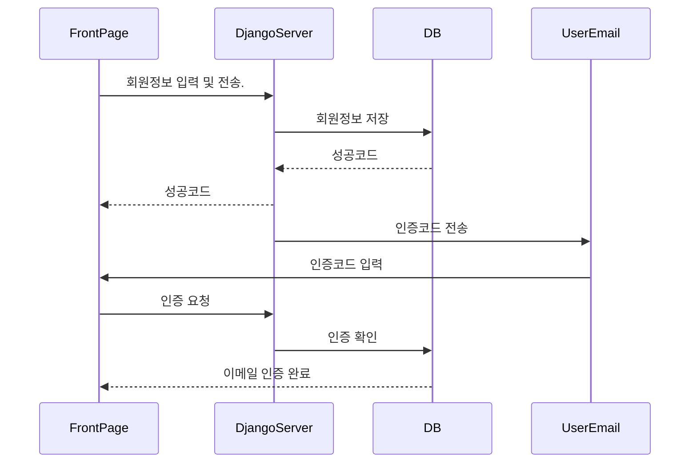
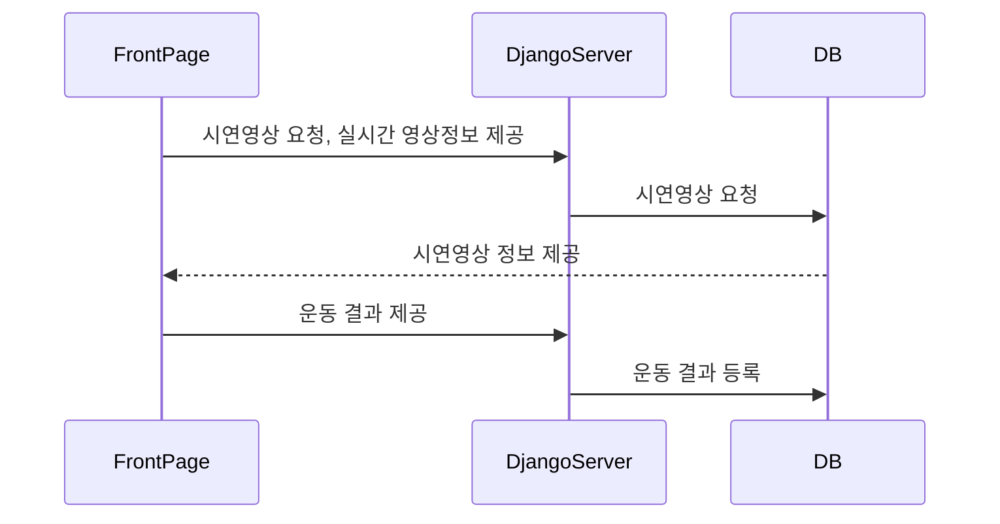
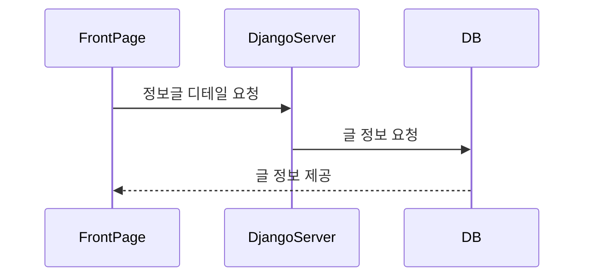
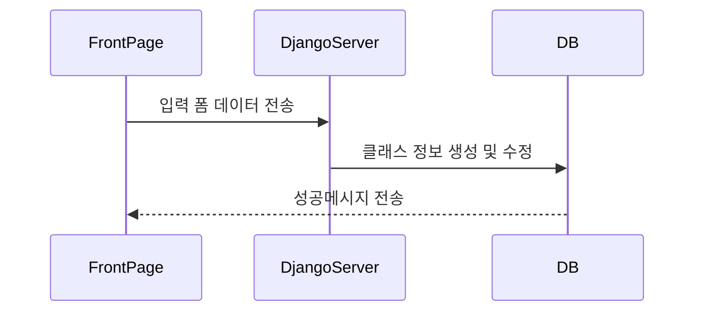
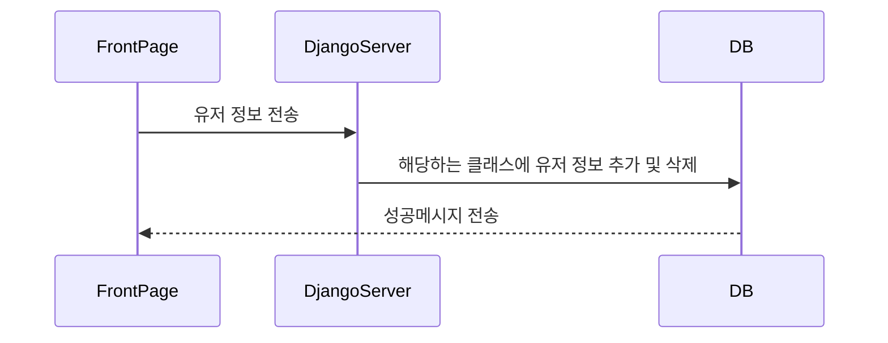
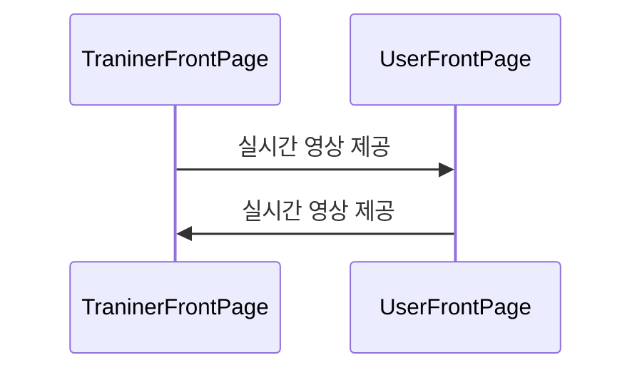

# CamFit

## 1. 로그인

로그인은 간단하게 ID, PW 입력을 통해 DB를 확인하여 로그인을 진행

```mermaid
sequenceDiagram

FrontPage->>DjangoServer:ID/PW입력
DjangoServer->>DB : 고객정보 확인
DB -->> FrontPage: 로그인 완료

```

## 2. 회원 가입

```mermaid
sequenceDiagram


FrontPage ->> DjangoServer : 회원정보 입력 및 전송. 
DjangoServer ->> DB : 회원정보 저장
DB -->> DjangoServer : 성공코드
DjangoServer -->> FrontPage : 성공코드
DjangoServer ->> UserEmail : 인증코드 전송
UserEmail ->> FrontPage : 인증코드 입력
FrontPage ->> DjangoServer : 인증 요청
DjangoServer ->> DB : 인증 확인
DB -->> FrontPage : 이메일 인증 완료


```

## 3. 운동하기(핵심기능)

```mermaid
sequenceDiagram

FrontPage ->> DjangoServer : 시연영상 요청, 실시간 영상정보 제공
DjangoServer ->> DB : 시연영상 요청
DB -->> FrontPage : 시연영상 정보 제공
FrontPage ->> DjangoServer : 운동 결과 제공
DjangoServer ->> DB : 운동 결과 등록

```

## 5. 정보게시판

```mermaid
sequenceDiagram

FrontPage ->> DjangoServer : 정보글 디테일 요청
DjangoServer ->> DB : 글 정보 요청
DB -->> FrontPage : 글 정보 제공

```

## 6. 클래스(핵심기능)

> 클래스 개설

```mermaid
sequenceDiagram

FrontPage ->> DjangoServer : 입력 폼 데이터 전송
DjangoServer ->> DB : 클래스 정보 생성 및 수정
DB -->> FrontPage : 성공메시지 전송


```

> 클래스 신청

```mermaid
sequenceDiagram

FrontPage ->> DjangoServer : 유저 정보 전송
DjangoServer ->> DB : 해당하는 클래스에 유저 정보 추가 및 삭제
DB -->> FrontPage : 성공메시지 전송


```

> 클래스 수업중

```mermaid
sequenceDiagram

TraninerFrontPage ->> UserFrontPage : 실시간 영상 제공
UserFrontPage ->> TraninerFrontPage : 실시간 영상 제공


```

